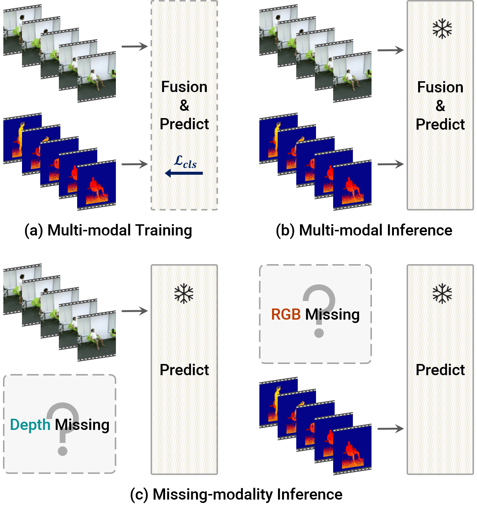

# ActionMAE
Pytorch code for our AAAI 2023 paper ["Towards Good Practices for Missing Modality Robust Action Recognition"](https://arxiv.org/abs/2211.13916).

### Action Recognition with Missing Modality
<div align="center">
  
</div>
<div align="center">
	Standard multi-modal action recognition assumes that the modalities used in the training stage are complete at inference time: (a) → (b). We address the action recognition problem in situations where such assumption is not established,
	i.e., when modalities are incomplete at inference time: (a) →
	(c). Our goal is to maintain performance in the absence of
	any input modality.
</div>

---

## Get Started
```
$ git clone https://github.com/sangminwoo/ActionMAE.git
$ cd ActionMAE
```

## Dependencies 
- Pytorch 1.11.0
- CUDA Toolkit 11.3
- NVIDIA Apex

### Environment Setup
- Install [Pytorch 1.11.0](https://pytorch.org/get-started/previous-versions/#linux-and-windows-4) with the following command.

```
conda install pytorch==1.11.0 torchvision==0.12.0 torchaudio==0.11.0 cudatoolkit=11.3 -c pytorch
```

- Goto [NVIDIA Apex](https://github.com/NVIDIA/apex#linux), and follow the instruction.

- See requirements.txt for all python dependencies, and you can install them using the following command.

```
$ pip install -r requirements.txt
```

## Train & Eval

```
$ ./train_val_actionmae_multigpu.sh
```

See/modify configurations in ``ActionMAE/lib/configs.py``

## Citation

    @inproceedings{woo2023towards,
      title={Towards Good Practices for Missing Modality Robust Action Recognition},
      author={Woo, Sangmin and Lee, Sumin and Park, Yeonju and Nugroho, Muhammad Adi and Kim, Changick},
      booktitle={Proceedings of the AAAI Conference on Artificial Intelligence},
      volume={37},
      number={1},
      year={2023}
    }

## Acknowledgement
We appreciate much the nicely organized codes developed by [MAE](https://github.com/facebookresearch/mae) and [pytorch-image-models](https://github.com/rwightman/pytorch-image-models). Our codebase is built on them.
